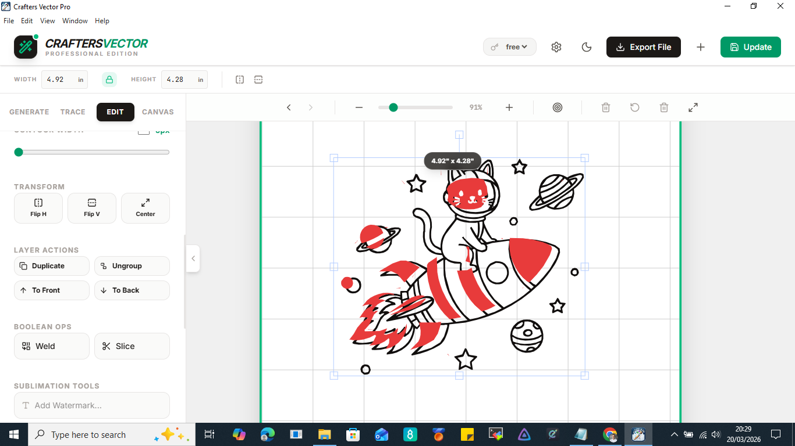

🎨 CrftersVector-Pro2: Desktop Vector Studio
Powered by Gemini AI | Local-First | Professional SVG Generation

CrftersVector-Pro2 is a high-performance desktop application designed for creators who need high-quality vector graphics without the complexity of traditional design software. By leveraging the Gemini 1.5 & 2.0 API, it turns text prompts into clean, scalable, and ready-to-use SVG files.

🚀 Key Features:
Local-First Architecture: Your API keys and settings stay on your machine. No cloud logins or data tracking.

Multi-OS Support: Built and optimized for Windows (.exe), macOS (.dmg), and Linux (.AppImage).

Dual-Tier Logic: Seamlessly toggle between Free Tier and Paid Tier Gemini keys to manage your usage limits.

Staff-Style UI: A clean, intuitive interface designed to look and feel like a native desktop tool.

Instant Export: Generate, preview, and save vectors directly to your local drive in seconds.

🛠️ How to Get Started:
Download the latest installer from the Releases tab.

Install and launch the app.

Click the Settings Gear to input your Gemini API Key.

Start creating!
